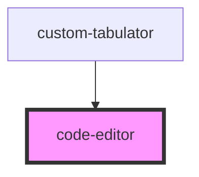

# code-editor

<!-- Auto Generated Below -->

## Properties

| Property        | Attribute         | Description | Type     | Default     |
| --------------- | ----------------- | ----------- | -------- | ----------- |
| `obj`           | `obj`             |             | `any`    | `undefined` |
| `relatedTo`     | `related-to`      |             | `string` | `undefined` |
| `relatedToUuid` | `related-to-uuid` |             | `string` | `undefined` |
| `value`         | `value`           |             | `string` | `undefined` |

## Events

| Event          | Description | Type                  |
| -------------- | ----------- | --------------------- |
| `inputChanged` |             | `CustomEvent<string>` |

## Dependencies

### Used by

 - [custom-tabulator](../custom-tabulator)

### Graph

----------------------------------------------

*Built with [StencilJS](https://stenciljs.com/)*
