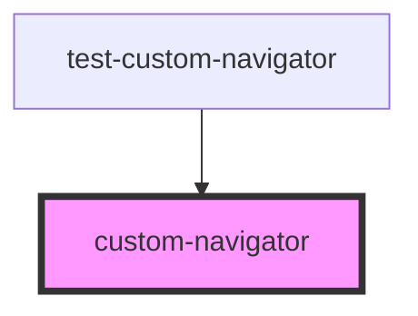

# custom-navigator

<!-- Auto Generated Below -->

## Properties

| Property      | Attribute     | Description | Type                                                              | Default     |
| ------------- | ------------- | ----------- | ----------------------------------------------------------------- | ----------- |
| `defaultTab`  | `default-tab` |             | `number`                                                          | `0`         |
| `navElements` | --            |             | `{ labelHtml: string; contentHtml: any; linkString?: string; }[]` | `undefined` |

## Dependencies

### Used by

 - [test-custom-navigator](../test-custom-navigator)

### Graph

----------------------------------------------

*Built with [StencilJS](https://stenciljs.com/)*
