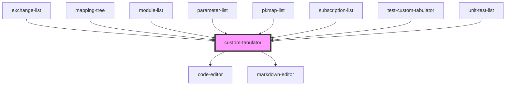

# custom-tabulator

<!-- Auto Generated Below -->

## Properties

| Property               | Attribute               | Description | Type                                                                                              | Default            |
| ---------------------- | ----------------------- | ----------- | ------------------------------------------------------------------------------------------------- | ------------------ |
| `actionButtonTags`     | --                      |             | `(string \| { tag: string; props: any; })[]`                                                      | `undefined`        |
| `childRowDefault`      | --                      |             | `Object`                                                                                          | `undefined`        |
| `columns` _(required)_ | --                      |             | `CustomTabulatorColumn[]`                                                                         | `undefined`        |
| `componentTitle`       | `component-title`       |             | `string`                                                                                          | `undefined`        |
| `confirmBeforeDelete`  | `confirm-before-delete` |             | `boolean`                                                                                         | `false`            |
| `data`                 | `data`                  |             | `any`                                                                                             | `undefined`        |
| `download`             | --                      |             | `{ type: DownloadType; fileName: () => string; options: DownloadOptions; }`                       | `undefined`        |
| `editionMode`          | `edition-mode`          |             | `"bottom" \| "inline" \| "modal" \| "side"`                                                       | `'inline'`         |
| `height`               | `height`                |             | `boolean \| number \| string`                                                                     | `false`            |
| `idPropName`           | `id-prop-name`          |             | `string`                                                                                          | `'uuid'`           |
| `index`                | `index`                 |             | `string`                                                                                          | `'uuid'`           |
| `isDeletionPermited`   | `is-deletion-permited`  |             | `boolean`                                                                                         | `true`             |
| `name` _(required)_    | `name`                  |             | `string`                                                                                          | `undefined`        |
| `options`              | --                      |             | `Options`                                                                                         | `{}`               |
| `postRoute`            | `post-route`            |             | `string`                                                                                          | `undefined`        |
| `readOnly`             | `read-only`             |             | `"createOnly" \| "updateOnly" \| boolean`                                                         | `false`            |
| `requestHeaders`       | --                      |             | `{ [key: string]: string; }`                                                                      | `undefined`        |
| `route` _(required)_   | `route`                 |             | `string`                                                                                          | `undefined`        |
| `rowDefault`           | --                      |             | `Object`                                                                                          | `undefined`        |
| `tabEndNewRow`         | `tab-end-new-row`       |             | `boolean`                                                                                         | `true`             |
| `tabulatorComponent`   | --                      |             | `TabulatorFull`                                                                                   | `undefined`        |
| `tabulatorLayout`      | `tabulator-layout`      |             | `"fitColumns" \| "fitData" \| "fitDataFill" \| "fitDataStretch" \| "fitDataTable"`                | `'fitDataStretch'` |
| `treeConfig`           | `tree-config`           |             | `boolean \| ({ childField: string; parentField: string; hideAddChild?: (row: any) => boolean; })` | `false`            |

## Events

| Event                     | Description | Type                                                            |
| ------------------------- | ----------- | --------------------------------------------------------------- |
| `loadedTable`             |             | `CustomEvent<{ table: CustomTabulatorRecMatching; }>`           |
| `rowDeleted`              |             | `CustomEvent<{ row: RowComponent; componentName: string; }>`    |
| `rowEditionButtonClicked` |             | `CustomEvent<{ row: RowComponent; componentName: string; }>`    |
| `rows`                    |             | `CustomEvent<{ rows: RowComponent[]; componentName: string; }>` |
| `rowSaved`                |             | `CustomEvent<{ rows: RowComponent[]; componentName: string; }>` |
| `rowSelected`             |             | `CustomEvent<{ rows: RowComponent[]; componentName: string; }>` |

## Methods

### `fillLookup(col: CustomTabulatorColumn) => Promise<void>`

#### Parameters

| Name  | Type                                                                                                                                                                                                                                                                                                                                                                                               | Description |
| ----- | -------------------------------------------------------------------------------------------------------------------------------------------------------------------------------------------------------------------------------------------------------------------------------------------------------------------------------------------------------------------------------------------------- | ----------- |
| `col` | `ColumnDefinition & { required?: boolean; createOnly?: boolean; updateOnly?: boolean; hideInModal?: boolean \| ((cell: CellComponent) => boolean); objectKeyProp?: string; modalFieldGroup?: string; editorReadOnly?: boolean \| ((cell: CellComponent) => boolean); editor?: "code" \| "select" \| "autocomplete" \| Editor \| "float" \| "markdown" \| "password"; obj?: any; type?: "array"; }` |             |

#### Returns

Type: `Promise<void>`

## Dependencies

### Used by

 - [exchange-list](../exchange-list)
 - [mapping-tree](../mapping-tree)
 - [module-list](../module-list)
 - [parameter-list](../parameter-list)
 - [pkmap-list](../pkmap-list)
 - [subscription-list](../subscription-list)
 - [test-custom-tabulator](../test-custom-tabulator)
 - [unit-test-list](../unit-test-list)

### Depends on

- [code-editor](../code-editor)
- [markdown-editor](../markdown-editor)

### Graph

----------------------------------------------

*Built with [StencilJS](https://stenciljs.com/)*
