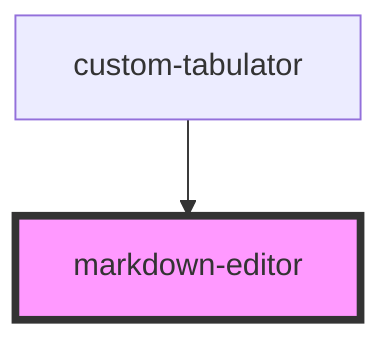

# markdown-editor

<!-- Auto Generated Below -->

## Properties

| Property        | Attribute | Description | Type                         | Default     |
| --------------- | --------- | ----------- | ---------------------------- | ----------- |
| `textareaStyle` | --        |             | `{ [key: string]: string; }` | `undefined` |
| `value`         | `value`   |             | `string`                     | `undefined` |

## Events

| Event          | Description | Type                  |
| -------------- | ----------- | --------------------- |
| `valueChanged` |             | `CustomEvent<string>` |

## Dependencies

### Used by

 - [custom-tabulator](../custom-tabulator)

### Graph

----------------------------------------------

*Built with [StencilJS](https://stenciljs.com/)*
