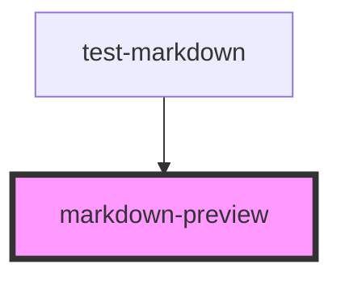

# markdown-preview

<!-- Auto Generated Below -->

## Properties

| Property   | Attribute  | Description | Type     | Default     |
| ---------- | ---------- | ----------- | -------- | ----------- |
| `markdown` | `markdown` |             | `string` | `undefined` |

## Dependencies

### Used by

 - [test-markdown](../test-markdown)

### Graph

----------------------------------------------

*Built with [StencilJS](https://stenciljs.com/)*
