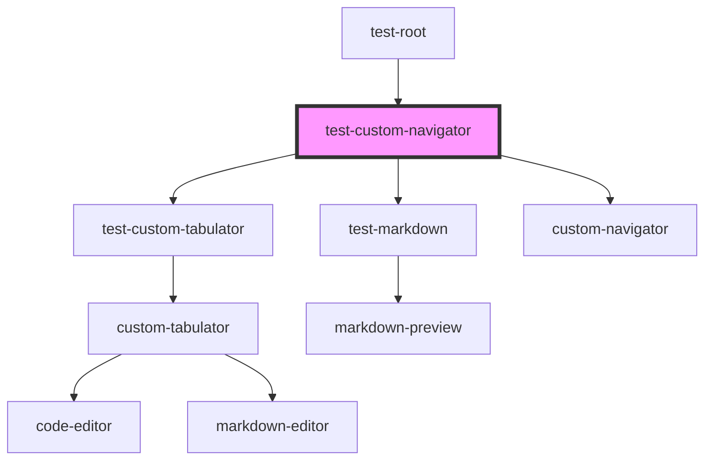

# test-custom-navigator

<!-- Auto Generated Below -->

## Properties

| Property | Attribute | Description | Type  | Default     |
| -------- | --------- | ----------- | ----- | ----------- |
| `match`  | `match`   |             | `any` | `undefined` |

## Dependencies

### Used by

 - [test-root](../test-root)

### Depends on

- [test-custom-tabulator](../test-custom-tabulator)
- [test-markdown](../test-markdown)
- [custom-navigator](../custom-navigator)

### Graph

----------------------------------------------

*Built with [StencilJS](https://stenciljs.com/)*
