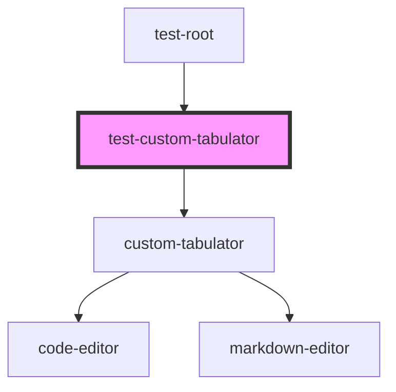

# test-custom-tabulator

<!-- Auto Generated Below -->

## Dependencies

### Used by

 - [test-root](../test-root)

### Depends on

- [custom-tabulator](../custom-tabulator)

### Graph

----------------------------------------------

*Built with [StencilJS](https://stenciljs.com/)*
